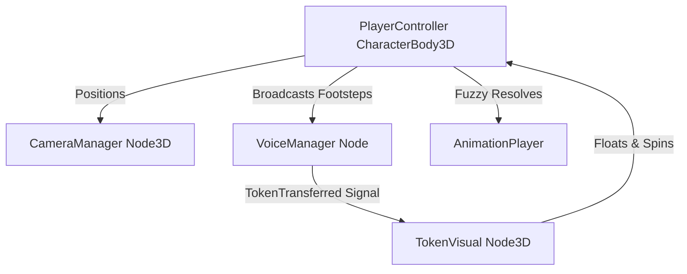

# Player & Camera Systems — Implementation Status & Analysis

This document details the features, components, and networking mechanics currently implemented for the player in the *Last Word* codebase. It provides a quick architectural reference for the player character, movement controls, orbit camera system, animations, audio cues, and multiplayer synchronization.

---

## 1. Core Architecture Overview

The player is represented by the [PlayerController.cs](file:///c:/Users/LENOVO/Documents/Last-word-godot/Scripts/Player/PlayerController.cs) script attached to a `CharacterBody3D` node in the player scene. Interaction with the world and third-person perspective is controlled by the [CameraManager.cs](file:///c:/Users/LENOVO/Documents/Last-word-godot/Scripts/Player/CameraManager.cs) script.

---

## 2. Implemented Features

### 2.1. Movement & Input Systems
* **WASD Walk & Sprint:** Implemented inside [PlayerController.cs](file:///c:/Users/LENOVO/Documents/Last-word-godot/Scripts/Player/PlayerController.cs#L121). Sprinting increases the maximum speed from `WalkSpeed` (5.0f) to `RunSpeed` (8.0f) dynamically when holding the sprint key (`move_sprint`).
* **Jumping & Gravity:** Gravity is continuously applied in physics ticks if the character is not grounded. Players can jump using `move_jump` (Space) when `IsOnFloor()` is true.
* **Safety Lock (Pause Lock):** All player movement inputs and jump attempts are automatically blocked whenever the pause menu is open (`PauseMenu.IsOpen`), freezing the player's physical state in the world.

### 2.2. Third-Person Orbit Camera
Controlled by the [CameraManager.cs](file:///c:/Users/LENOVO/Documents/Last-word-godot/Scripts/Player/CameraManager.cs) script, which is detached from the player character parent node (`TopLevel = true`) to achieve smooth tracking.
* **Smoothing Follow & Rotation:** Global position interpolates (`CameraFollowSpeed` = 10f) toward the player's feet plus the initial offset, while mouse motion orbits the camera pivot along the X and Y axes.
* **Physics Jitter Elimination:** Process priority is set to `100` (`ProcessPhysicsPriority = 100`) to guarantee that camera tracking runs *after* character movements are fully finalized in the physics step, removing visual stutter.
* **Scroll Wheel Zoom:** Players can adjust zoom levels using the mouse scroll wheel. Zoom is clamped between `MinZoomDistance` (1.0m) and `MaxZoomDistance` (5.0m).
* **Smart Camera Collision:** A physical spatial raycast is shot from the pivot to the camera's current offset position. If a wall or ceiling collides with the raycast, the camera is dynamically pulled forward (minus `CameraCollisionOffset`) to prevent it from clipping through geometry. The player's own collider is excluded from collision checks.
* **Sensitivity Loading:** Mouse sensitivity is automatically loaded from the persistent configuration file (`user://settings.cfg`) under `[controls] mouse_sens` (defaulting to 0.2f if missing).

### 2.3. Animation Blending & State Machine
* **Fuzzy Animation Resolver:** During `_Ready()`, the controller recursively searches for an `AnimationPlayer` child node, maps available animation clips using case-insensitive fuzzy string matches (`idle`, `walk`, `run`/`sprint`, `jump`), and ignores clips associated with specific puzzle actions (like `carry`).
* **Crossfade Blending:** Triggers smooth transition crossfades (0.25s) between states (Idle $\rightarrow$ Walk $\rightarrow$ Run) to prevent harsh snapping.
* **Mid-Air Freeze:** In airborne states, once the jump animation reaches its last frame, playback pauses on the final pose in mid-air. On landing (`IsOnFloor()`), the script immediately unpauses and blends smoothly back into the active ground motion (Idle, Walk, or Run).

### 2.4. Footstep & Landing Noise Emitter
* **Timed footstep triggers:** Footsteps are timed on intervals (`0.5s` for walking, `0.3s` for running) when moving on the floor.
* **Sound Tier Classification:** 
  * Walking emits a **Tier 0** (Silent) noise event.
  * Running/Sprinting emits a **Tier 1** (Whisper) noise event.
  * Landing from a fall emits a **Tier 2** (Normal) noise event.
* **Network Notification:** Triggers are processed locally by the authority player and sent to the server using `VoiceManager.ReportNoiseEvent` to notify the Listener AI.

### 2.5. Token Visual System
Handled by the [TokenVisual.cs](file:///c:/Users/LENOVO/Documents/Last-word-godot/Scripts/Player/TokenVisual.cs) script:
* **Floating skull placement:** Pins a floating node (typically a skull icon mesh) at `FloatHeight` (1.5m) above the active holder.
* **Constant rotation animation:** Continually spins the mesh along the Y-axis (`SpinSpeed` = 2.0 rad/s) for visual flair.
* **Visibility toggle:** Automatically hides or shows itself by subscribing to `VoiceManager.Instance.TokenTransferred` signals.

### 2.6. Multiplayer Synchronization
* **Authority Assignment:** During player spawn, if the node's name represents a number, it is parsed into a unique network client peer ID and assigned via `SetMultiplayerAuthority()`.
* **Input & Camera Isolation:** In the client/server network loop, if a player controller belongs to a remote peer:
  * Local inputs are blocked entirely.
  * The attached `CameraManager` node is destroyed immediately (`QueueFree()`) to avoid multi-camera conflicts.
  * The local client interpolates remote character positions and updates animations based on network transform synchronization.

### 2.7. Keyboard Voice Simulation (Developer Testing Override)
Added direct keyboard shortcuts in the voice analysis loop for testing game mechanics under silent conditions or without a working microphone:
* **Key 1 (Hold):** Simulates **Whisper** input (Tier 1, -40dB volume level).
* **Key 2 (Hold):** Simulates **Normal** voice input (Tier 2, -25dB volume level, triggers Listener alert/chase).
* **Key 3 (Hold):** Simulates **Scream/Shout** voice input (Tier 3, -5dB volume level, forces Listener into a Frenzy state).
* Facilitates rapid, deterministic validation of sound hearing thresholds and billboard state labels programmatically.

---

## 3. Reference Files

- **Player Controller Script:** [PlayerController.cs](file:///c:/Users/LENOVO/Documents/Last-word-godot/Scripts/Player/PlayerController.cs)
- **Camera Controller Script:** [CameraManager.cs](file:///c:/Users/LENOVO/Documents/Last-word-godot/Scripts/Player/CameraManager.cs)
- **Token Attachment Script:** [TokenVisual.cs](file:///c:/Users/LENOVO/Documents/Last-word-godot/Scripts/Player/TokenVisual.cs)
